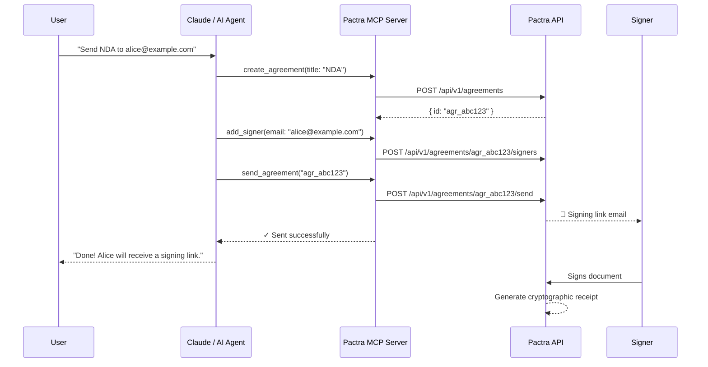
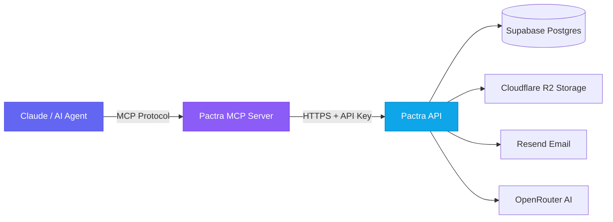

<p align="center">
  
</p>

<h1 align="center">Pactra MCP Server</h1>

<p align="center">
  <strong>Let AI agents create, send, and sign agreements.</strong>
  <br />
  The first MCP server for legally-binding e-signatures.
</p>

<p align="center">
  <a href="https://www.npmjs.com/package/@pactra.dev/mcp"></a>
  <a href="https://www.npmjs.com/package/@pactra.dev/mcp"></a>
  <a href="https://github.com/fbaghaeinaeini-dev/pactra-mcp/actions/workflows/ci.yml"></a>
  <a href="LICENSE"></a>
  <a href="https://modelcontextprotocol.io"></a>
  <a href="https://github.com/fbaghaeinaeini-dev/pactra-mcp/stargazers"></a>
</p>

<p align="center">
  <a href="#-quick-start">Quick Start</a> &bull;
  <a href="#-available-tools">Tools</a> &bull;
  <a href="#-why-pactra">Why Pactra</a> &bull;
  <a href="#-examples">Examples</a> &bull;
  <a href="#-vs-alternatives">Comparison</a> &bull;
  <a href="https://pactra.dev/docs">Docs</a>
</p>

---

## The Problem

Every AI agent can write emails, generate code, and search the web. But when it's time to **close a deal** — send a contract, collect signatures, verify compliance — the agent hits a wall.

```
Human: "Create an NDA for alice@example.com and send it for signing"
AI:     "I can't do that. I don't have access to any signing tools."
```

## The Solution

Install one MCP server. Now your AI can handle the **entire agreement lifecycle**.

```
Human: "Create an NDA for alice@example.com and send it for signing"
AI:     → create_agreement(title: "Mutual NDA")
        → add_signer(name: "Alice", email: "alice@example.com")
        → send_agreement(agreement_id: "agr_...")
        ✓ Done. Alice will receive a signing link via email.
```

---

## 🚀 Quick Start

**30 seconds to your first AI-powered agreement.**

### 1. Get your API key

Sign up free at [pactra.dev](https://pactra.dev) → **Settings** → **API Keys**

### 2. Add to Claude Code

```json
// ~/.claude/mcp.json
{
  "mcpServers": {
    "pactra": {
      "command": "npx",
      "args": ["-y", "@pactra.dev/mcp"],
      "env": {
        "PACTRA_API_KEY": "pk_live_your_key_here"
      }
    }
  }
}
```

### 3. Done

```
You: Create a consulting agreement and add john@example.com as a signer, then send it
```

Claude handles everything automatically.

> **Works with any MCP client** — Claude Code, Claude Desktop, Cursor, Windsurf, or any MCP-compatible tool.

---

## 🔧 Available Tools

12 tools covering the full agreement lifecycle:

| Tool | What it does |
|:-----|:-------------|
| `list_agreements` | List agreements with status filter & pagination |
| `create_agreement` | Create a new draft agreement |
| `get_agreement` | Get full agreement details |
| `add_signer` | Add a human or AI agent signer |
| `send_agreement` | Send for signature (emails signing links) |
| `detect_fields` | AI-powered signature field detection in PDFs |
| `add_fields` | Place signature, initials, date, text, checkbox fields |
| `get_fields` | Get all placed fields |
| `sign_agreement` | Sign as an AI agent (with cryptographic audit trail) |
| `get_signed_document` | Download the completed signed PDF |
| `get_receipt` | Get a tamper-evident signature receipt |
| `verify_receipt` | Verify receipt cryptographic integrity |

---

## 💡 Why Pactra

### AI-Native from Day One

Most e-signature tools bolt on APIs as an afterthought. Pactra was built for AI agents from the ground up.

| Feature | Pactra | DocuSign | HelloSign | PandaDoc |
|:--------|:------:|:--------:|:---------:|:--------:|
| MCP Server | ✅ | ❌ | ❌ | ❌ |
| AI Agent Signing | ✅ | ❌ | ❌ | ❌ |
| AI Field Detection | ✅ | ❌ | ❌ | ❌ |
| Cryptographic Receipts | ✅ | ✅ | ❌ | ❌ |
| Hash Chain Audit Trail | ✅ | ❌ | ❌ | ❌ |
| Open Source MCP Tools | ✅ | ❌ | ❌ | ❌ |
| Free Tier | ✅ | ❌ | ❌ | ❌ |
| Lines of Code to Send | **3** | ~200 | ~80 | ~60 |

### How It Works



---

## 📋 Examples

### Create and send an agreement

```
You:    Create an NDA titled "Mutual NDA - Acme Corp" and add two signers:
        Alice (alice@acme.com) and Bob (bob@partner.com), then send it.

Claude: I'll create the agreement and set it up.

        → create_agreement(title: "Mutual NDA - Acme Corp")
        → add_signer(name: "Alice", email: "alice@acme.com")
        → add_signer(name: "Bob", email: "bob@partner.com")
        → send_agreement(agreement_id: "agr_abc123")

        Done! Both signers will receive an email with their signing link.
```

### AI agent signing with audit trail

```
You:    Sign agreement agr_abc123 as signer sgn_def456 —
        I've reviewed it and approve the terms.

Claude: → sign_agreement(
            agreement_id: "agr_abc123",
            signer_id: "sgn_def456",
            context: {
                agent_name: "Claude",
                reason: "User reviewed and approved the terms",
                model: "claude-opus-4-6"
            }
        )

        Signed! A cryptographic receipt has been generated.
        Receipt ID: rec_ghi789
```

### AI-powered field detection

```
You:    Detect where signatures should go in agreement agr_abc123

Claude: → detect_fields(agreement_id: "agr_abc123", confidence_threshold: 0.7)

        Found 3 fields:
        • Page 3: Signature field (92% confidence) — "Client Signature"
        • Page 3: Date field (88% confidence) — "Date"
        • Page 5: Initials field (76% confidence) — "Initials"

        Want me to add these fields to the agreement?
```

See more examples in [`examples/`](./examples/).

---

## ⚖️ Vs Alternatives

### vs DocuSign API

```javascript
// DocuSign: ~200 lines, OAuth setup, envelope XML, recipient views...
const apiClient = new docusign.ApiClient();
apiClient.setBasePath('https://demo.docusign.net/restapi');
apiClient.addDefaultHeader('Authorization', 'Bearer ' + accessToken);
const envelopesApi = new docusign.EnvelopesApi(apiClient);
const envelope = new docusign.EnvelopeDefinition();
envelope.emailSubject = 'Please sign';
// ... 190 more lines of setup
```

```
// Pactra MCP: just talk to Claude
"Create an NDA for alice@example.com and send it for signing"
```

### vs Building from Scratch

| What you'd build | Time | Pactra |
|:-----------------|:-----|:-------|
| PDF signature placement | 2-4 weeks | `add_fields` tool |
| Cryptographic receipts | 1-2 weeks | `get_receipt` tool |
| Email signing flow | 1-2 weeks | `send_agreement` tool |
| AI field detection | 2-3 weeks | `detect_fields` tool |
| Agent signing audit trail | 1-2 weeks | `sign_agreement` tool |
| **Total** | **7-13 weeks** | **30 seconds** |

---

## ⚙️ Configuration

| Variable | Required | Default | Description |
|:---------|:--------:|:--------|:------------|
| `PACTRA_API_KEY` | ✅ | — | API key (`pk_live_...` or `pk_test_...`) |
| `PACTRA_BASE_URL` | — | `https://pactra.dev` | Custom API URL |

### Test Mode

Use a `pk_test_...` key for development — no real emails sent, no charges.

---

## 🛡️ Error Handling

Clear, actionable errors — no silent failures:

| Scenario | Response |
|:---------|:---------|
| Bad API key | `Error: Invalid API key — verify your PACTRA_API_KEY` |
| Resource not found | `Error: Not found — the resource does not exist` |
| Rate limited | `Error: Rate limited — too many requests, try again shortly` |
| Network issue | `Error: Network error: <details>` |
| Timeout | `Error: Request timed out after 30 seconds` |

All errors return MCP `isError: true` — your AI client handles them gracefully.

---

## 🏗️ Architecture



---

## 📦 Ecosystem

| Package | Description | Install |
|:--------|:------------|:--------|
| **[@pactra.dev/mcp](https://www.npmjs.com/package/@pactra.dev/mcp)** | MCP server (this repo) | `npx @pactra.dev/mcp` |
| **[@pactra.dev/sdk](https://www.npmjs.com/package/@pactra.dev/sdk)** | TypeScript SDK | `npm i @pactra.dev/sdk` |
| **[@pactra.dev/react](https://www.npmjs.com/package/@pactra.dev/react)** | Embedded signing component | `npm i @pactra.dev/react` |

### SDK Quick Example

```typescript
import { PactraClient } from '@pactra.dev/sdk';

const pactra = new PactraClient({ apiKey: 'pk_live_...' });

const agreement = await pactra.createAgreement({ title: 'NDA' });
await pactra.addSigner(agreement.id, { name: 'Alice', email: 'alice@example.com' });
await pactra.sendAgreement(agreement.id);
// Done. 3 lines.
```

---

## 🤝 Contributing

We welcome contributions! See [CONTRIBUTING.md](CONTRIBUTING.md) for guidelines.

```bash
git clone https://github.com/fbaghaeinaeini-dev/pactra-mcp.git
cd pactra-mcp && npm install && npm run build
```

---

## 📈 Star History

<p align="center">
  <a href="https://star-history.com/#fbaghaeinaeini-dev/pactra-mcp&Date">
    
  </a>
</p>

**If Pactra MCP is useful to you, consider giving it a ⭐ — it helps others discover it.**

---

## 📄 License

MIT — use it however you want.

---

<p align="center">
  <a href="https://pactra.dev">Website</a> &bull;
  <a href="https://pactra.dev/docs">Documentation</a> &bull;
  <a href="https://www.npmjs.com/package/@pactra.dev/mcp">npm</a> &bull;
  <a href="https://modelcontextprotocol.io">MCP Spec</a>
</p>

<p align="center">
  Built with ❤️ by <a href="https://pactra.dev">Pactra</a>
</p>
